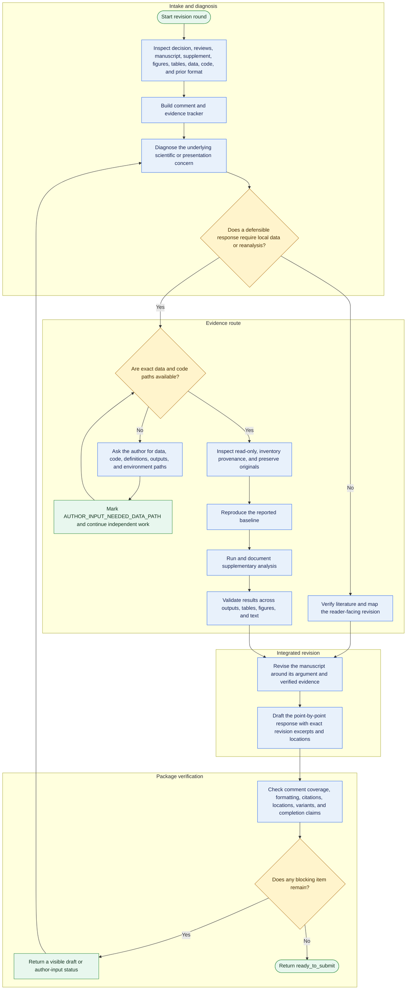

# Reviewer-response workflow

Use this workflow for each revision round. The local-data gate prevents analytical claims from being drafted before the underlying files and reproducible outputs are available.

The loop from `AUTHOR_INPUT_NEEDED_DATA_PATH` resumes only after the author supplies usable paths. An explicit author decision to postpone the item changes its status to `DEFERRED_BY_AUTHOR`; it does not make the package submission-ready.
